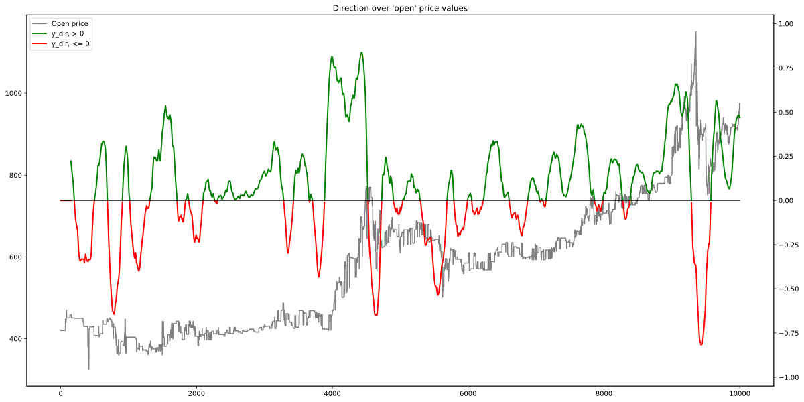
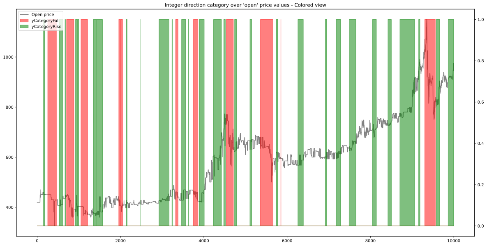

The `DataStreamCreator` class consists of several sub-classes for generating tick data frames (X-blocks), some future price or trade information for training (y data) and one for converting a file list of OHLCV csv data into a data stream of these two informations.

# **XBlockGenerator**
The `XBlockGenerator` class is used to generate time-frame slices (= X-blocks) out of a time series table of tick and indicator data.
For this task, an input `pd.DataFrame` `tickAndIndicatorDF` is processed row by row.
It is called 'X' because its purpose is to be used as input data for machine learning networks (== X-data).

Every X-block is created by using a specific amount of table rows, defined by the `int` parameter `X_Block_lenght`.
If the tick data is in hours and `X_Block_lenght=12`, the generator would return slices of 12 hours.
The step size between the X-blocks is 1, so the resulting DFs in the example would be: 00:00-11:00, 01:00-12:00, 02:00-13:00, ...

The big advantage of using the `XBlockGenerator` instead of just feeding the training table data is that nearly every timestamp in the dataset is used as 'now' time in the training data. With 
`X_Block_lenght=12`, from the example table in [BTC-USDT.csv](DemoData/BTC-USDT.csv) containing 49.403 timesteps 49.403-48=49.355 blocks can be generated. As every X-Block contains 48 timesteps, a total amount of 49.355*48 = **2.369.040** time slices are fed to training the network. 

An analogy to this process is if you zoom in on the hourly chart of the BTC-USDT price to show 48 hours, an then scroll forward for one hour step by step and take a look / a screenshot a every step.

---
### Example charts for X-Blocks

In these example charts, only the open price column is plotted to keep the charts tidy. The behaviour for all other columns (other price data and indicator) is the same, as the X-Block generator slices on a time-basis and preserves the feature dimension.

The `X_Block_lenght` is set to `48` in the examples, so on a hourly tick basis, every X-Block covers 2 days. The Jupyter notebook used to generate these examples can be found under [**XBlockGeneratorExample.ipynb**](JupyterDocker/notebooks/XBlockGeneratorExample.ipynb).

The following chart shows first 20 X-Blocks. To visualize the shifting process, a black dot is added, which is always plotted at the same absolute timestamp.

---
### Requried constructor arguments:
- `tick_and_indicator_DF`: An `pd.DataFrame` containing a time series of tick and indicator data. This table is normally created using the `IndicatorCalculator` class.
- `generator_batch_size`: An `int` variable defining how many X-Blocks the generator shall return on each `next()` call.
- `X_Block_lenght`: This `int` variable defines how many timestamps each X-Block shall cover. Former called `X_lookback_cnt`.
- `initial_value_norm`: A `bool` value to switch if all indicators included in `Todo` shall be normalized based on the first value in each X-block. This is then done for each indicator individually, the first value is then 0.0, all following are relative to it. Used for volume inidcators with a large spread. `True` by default.
- `limit_volume_value`: A `bool` value to switch if the volume column shall be scaled to a maximum value of `1.0`. This can be helpful as the volume may have a large absolute value spread. `True` by default.

### Returns
A generator, X-blocks can be acquired using `next()`
### Raises
StopIteration if the tick and indicator table is fully consumed

# **YDataGenerator**

The `YDataGenerator` class is used to generate future information for training out of a time series table of tick and indicator data.
This can for example be the assets relative price or gain in 24 hours, the direction of movement, or trade entry and exit signals.

IMPORTANT: This class can of course not look into the future, so if you want to output the price in 24 hours, this can only be done until
table index `len(timestamp rows) - 24`, otherwise it would really have to look into the future!

The purpose of this class is to generate machine-learning target data (y-values) according to the X-Blocks generated by the `XBlockGenerator`.
The X-Block contains data from the past, which is known in a live application, while the Y data is unknown in the live application, and therefore has to be predicted.
Here, it can be generated for training purposes using historical data.

As a price basis for calculating the y data, the `open` column of the input table `tick_DF` is used.

The y data generator can be structure into 4 sections, namely the 4 different types of signals that can be generated, depending on the strategy used in machine learning training.

A Jupyter notebook containing example code for generating the signals can be found under [**YDataGeneratorExamples.ipynb**](JupyterDocker/notebooks/YDataGeneratorExamples.ipynb).

---
### Requried constructor arguments
- `tick_DF`: An `pd.DataFrame` containing a time series of at tick data. Only the `open` column is used.
- `todo`: some stuff

---
### Returns
A generator, y data can be acquired using `next()`

---
### Raises
StopIteration if the tick table is fully consumed

### Y_DATA_TYPE_DIRECTION_FLOAT

This data type generates a direction signal of price movement and its derivation.

 It takes the following parameters:
- `direction_ma_timespan`: Default 200, this parameter describes how fast the direction information follows price changes
- `derivation_ma_timespan`: Default 100, this parameter describes how fast the derivation information direction changes
- `direction_derivation_shift_span`: Default 0, this parameter sets a shifting of the direction and derivation information

The output of this data type is the direction of price movement and its derivation: `np.array [direction, directionDerivation]`

---
### Y_DATA_TYPE_DIRECTION_CATEGORICAL

This data type generates a direction signal of price movement and its derivation. 

It takes the following parameters:
- `direction_ma_timespan`: Default 200, this parameter describes how fast the direction information follows price changes
- `derivation_ma_timespan`: Default 100, this parameter describes how fast the derivation information direction changes
- `direction_derivation_shift_span`: Default 0, this parameter sets a shifting of the direction and derivation information
- `fall_threshold`: Default -0.2, this parameter set a limit for the direction value from which it shall be considered rising. The derivation of the direction has also to be over 0 to assume rising.
- `rise_threshold`: Default 0.1, this parameter set a limit for the direction value from which it shall be considered falling

The output of this data type is the integer category of the price movement based on its direction info (from the previous Y_DATA_TYPE_DIRECTION_FLOAT): `np.array [integerCategory]`

---
### Y_DATA_TYPE_TRADE_SIGNALS

This is the most sophisticated data generator based on the direction of price movement and its derivation. It uses three entry and two exit thresholds to generate trade signals whether one should enter (-> buy) or exit (-> sell). As the future is known in the train data generation step, very precise entry and exit signals can be generated. These signals can then be trained into a machine learning network.

As these parameters are rather sensitve and depend on the type of tick data (crypto, stock, long/short-term, ...), there will be a notebook for finding an optimum of them based on a training data set. (*Todo: Add the finder notebook*)

It takes the following parameters:
- `direction_ma_timespan`: Default 200, this parameter describes how fast the direction information follows price changes
- `derivation_ma_timespan`: Default 100, this parameter describes how fast the derivation information direction changes
- `direction_derivation_shift_span`: Default 0, this parameter sets a shifting of the direction and derivation information
- `future_direction_shift_timespan`: Default 24, this parameter determines from which future timestep the information is used to generate signals. (-> Look if a trade would be profitable)
- `entr_thr1`, `entr_thr2`, `entr_thr3`: Thresholds for generating entry signals based on this equation: `(direction >= entr_thr1) & (_direction_futureshifted >= entr_thr2) & (directionDerivation >= entr_thr3)`
- `exit_thr1`, `exit_thr2`: Thresholds for generating exit signals based on this equation: `(direction <= exit_thr1) & (_direction_futureshifted <= exit_thr2)`

The output of this data type is the one-hot-encoded category of the price movement: `np.array [entry, exit, neutral]`

---
### Y_DATA_TYPE_PAST_FUTURE_GAIN

Todo: Test and write it

