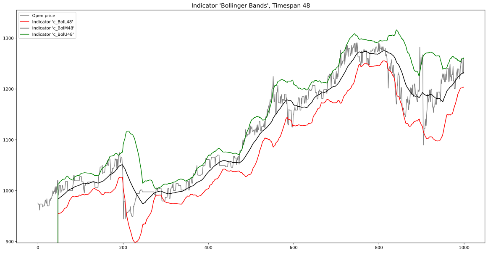
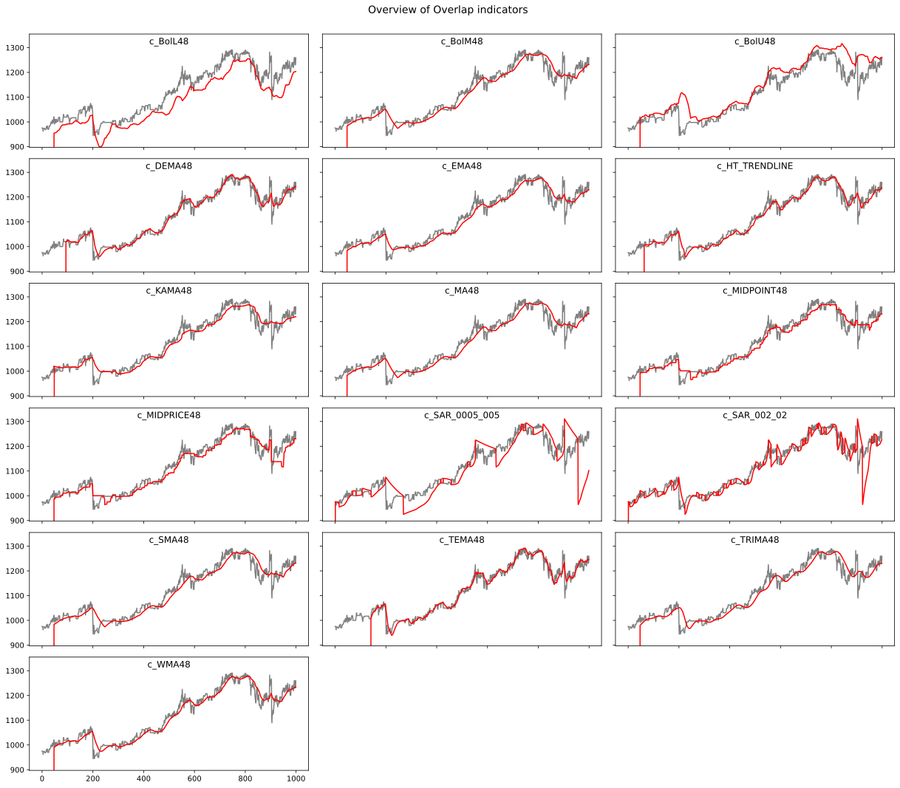
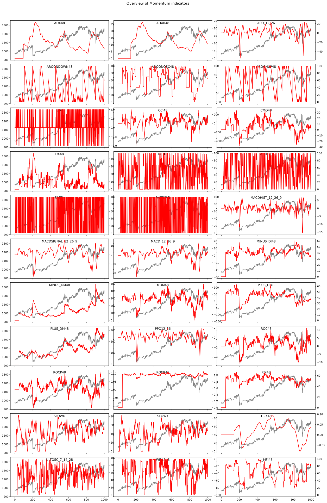
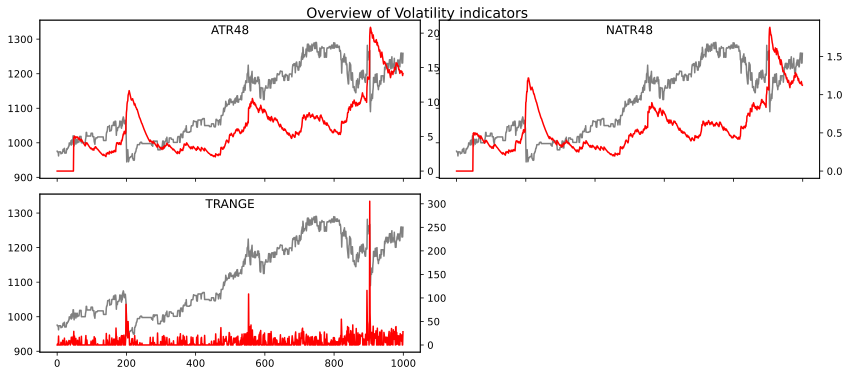
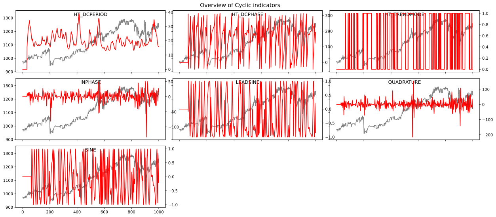
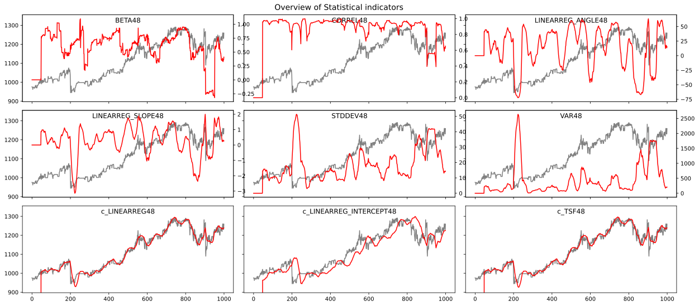
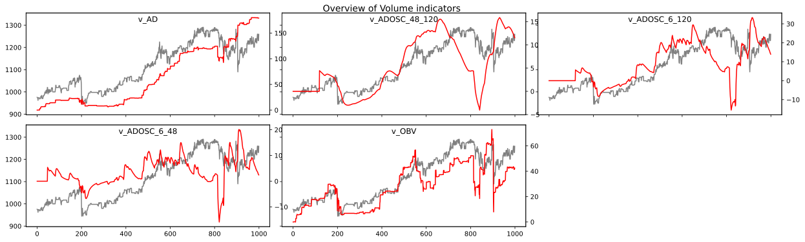
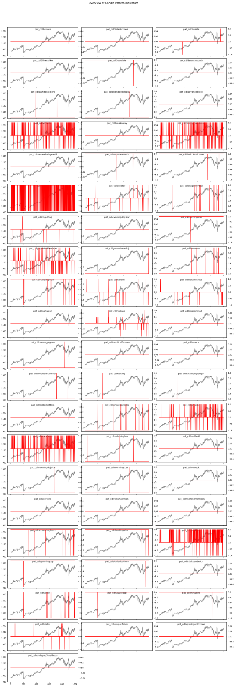

Todo: There should be some doku...

# Illustration of the calculated indicators

In this illustration, an overview of the calculated indicators is given. For this example, an indicator timespan of `48` was used. In the final application, most of these indicators are calulated using three timespans, for example `6`, `48` and `120`.

---
### Bollinger Bands

---
### Overlap indicators

---
### Momentum indicators

---
### Volatility indicators

---
### Cyclic Indicators

---
### Statistical Indicators

---
### Volume Indicators

---
### Candle Pattern Indicators

