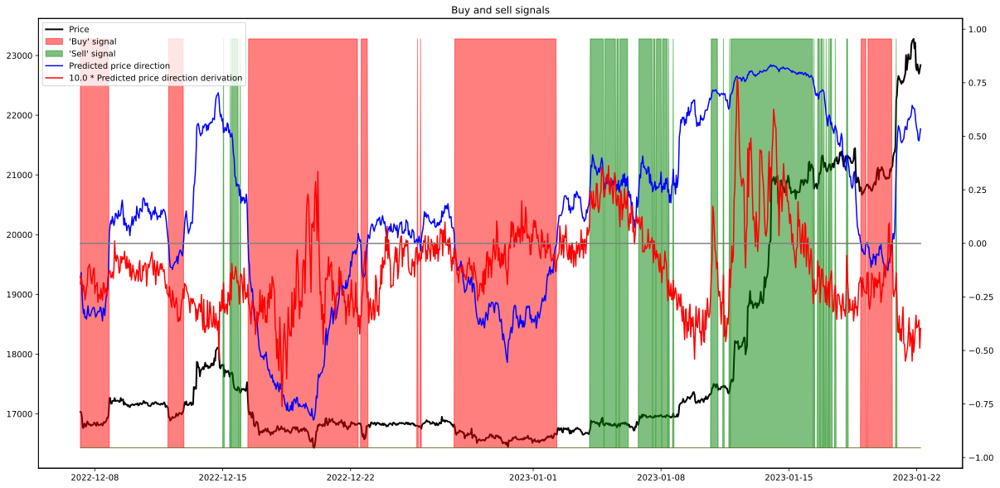
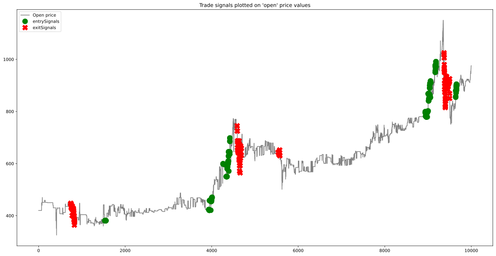

# CryptoCrystalBall - Predict the future of crypto and stock prices

<h2> A framework for predicting entry and exit signals for trading cryptocurrencies (or ETFs, stocks, ...).</h2>

This whole project is more a kind of a 'research' project to find a method of automatically generating trade entry and exit signals than a ready-to-use application. Of course, if I find a suitable and general enough algorithm, it can then be used as a live trading application to earn money.

:warning::warning: WARNING: If you use any trade signals from this application for trading with real money, be aware they could be misleading! You could loose your money, be careful and think of what you are doing! I cannot and will not take any responsibility for the generated signals. :warning::warning:

Most work is done in Jupyter Notebooks in [Google Colab](https://colab.research.google.com/), which is able to read and write data from the Google Drive, but also from the Google Bucket storage. This is very convenient, but it requires a Google account to enable all features.

As I have to clean up and document all my code, please be patient that not everything is already here!

## Example notebooks

---
### Live buy/sell signals predictor

In this colab notebook, you can predict live buy/sell signals for `BTC-USDT` using a pre-trained example model:

---

### Feature testing

If you want to try the features on your own, please run this colab notebook:

---

### Learn how to train a model

If you want to see how the model is trained and then the price direction is predicted, please run this colab notebook:

---

## Brief feature overview

This is the part for the people who do not want to read much text! So whats the purpose of this repo? The final goal is to generate trade signals like this:

So whats the way to this goal?

1. Calculate financial indicators on a given training OHLCV dataset. --> [IndicatorCalculator](IndicatorCalculator/README.md)
2. Generate pairs of past tick data (`X-Blocks`) and future trade signals (`y-data`) out of the OHLCV + Indicator training data. --> [XBlockGenerator + YDataGenerator](DataStreamCreator/README.md#xblockgenerator)
3. Merge them into a shuffled stream of data --> [FileListToDataStream](DataStreamCreator/README.md#filelisttodatastream)
4. Feed the stream to a neural network, which shall learn to predict the signals out of an `X-Block`. --> [NeuralNetworkTrainingExample.ipynb](JupyterDocker/notebooks/NeuralNetworkTrainingExample.ipynb)
5. Evaluate the model to check if the signals are right.  --> [Todo: Add the testing notebook](nothing.md)
6. Run the model in the live application and have fun :grin:. --> [SignalGenerator, Todo: Has to be adapted](SignalGenerator)

All of these steps are more or less already programmed, I just have to clean the code up so that someone except me understands it, so please be patient!

---
## Training and Testing Data Source

The crypto history data is provided in .csv files on google drive. You can copy them to your own drive using this Link: [Get the data](https://drive.google.com/drive/folders/1HUq1YTD_5N4j6a42ZdchUytdTDYVyXce?usp=sharing)

The important folders are:

- train - Data for training
- test - Data for testing
- real03 - Data for double-testing, for example if the model is trained on the *train* data, the trade algorithm has been developed using the *test* data, this one can be used to evaluate both of them

---
## Treat tick history as a 'sentence'

This is an approach to treat the historical tick and indicator data, contained in an `X-Block`, like a sentence in natural language. The intention behind this is to take advantage of the high performance of NLP-networks (Natual Language Processing, --> see ChatGPT as recent example) to process the tick data an find interesting patterns. 

A `X-Block` is basically a time series of feature vectors, with each vector containing around 200 single float values (a detallied description is available in the classes dokumentation under [XBlockGenerator](DataStreamCreator/README.md#xblockgenerator)). To match the input format of NLP networks, these vectors have to be mapped to limited range integer values (200 float values --> 1 integer value). 

In natural language, this integer is the representative of a *word*, therefore the range of integers is called the *vocabulary*. An example *vocabulary* for a real language model an be found under [BERT vocab from Huggingface](https://huggingface.**co**/bert-base-cased/blob/main/vocab.txt). In this file, words (and some special characters) are mapped to integer numbers. This vocabulary has a range of 28996 individual words. An  explanation about tokenization to get from a natural language text to tokens can be found under this [Link](https://www.geeksforgeeks.org/nlp-how-tokenizing-text-sentence-words-works/).

In the scope of this project, a *word* would represent a specific pattern of tick and indicator data at one timestep. For better differentiation, lets call these 'word' made of tick and indicator data *tick-word* from now on, just to avoid confusion.

My apporach is now to use clustering methods on a big set of different feature vectors gathered from X-Blocks to create a *tick-vocabulary*, conisting of integers.
This vocabulary of integers would now allow a convertion of the historical tick and indicator frame into a *tick-sentence*, or in other word, an array of intergers with the lenght `X_Block_lenght`, which can then be fed to a NLP network.

I already did some promising tests on this approach, although there is much work left to do until it runs right. For example:

- Building a good, reliable and robust(!) clustering from feature vectors to a vocabulary. 
A test version can be found under [X_Data_Clusterer.ipynb](X_Data_Clusterer/X_Data_Clusterer.ipynb).
- Create a transformer pipeline for transforming X-Blocks into 'tick-sentences' seamlessly during training
- Train a NLP model from scatch in a fill-mask way (see [What is fill-mask?](https://huggingface.co/tasks/fill-mask) for more information) --> Possible on GPU? Or maybe on a TPU? --> TPU does not support transformer pipeline in python
- Train a direction or trade signal predictor as model output
- Evaluate results on a test-set

---
## Contribution

If you are interested in one of the following topic, it would be a pleasure for me if you would contribute, as I follow this project only in my private time, which is unfortuneatly far too limited! :smile:

For getting informed about updates or for writing me questions please visit: [My Reddit Page ](https://www.reddit.com/user/girsman)

Of course I would also appreciate a donation if you like my work :smirk::

 **BTC:**:16F966Xbd4vr28ziu6ChC2PePmiyjEnA2t

 **ETH:**
0xF5cB4799f46fA6Cc37b90C396BdB1389f371138c

 **DOGE:**
DRWwSSrgFGZL8oaTpHJYCaPLo9c9qF4Gsf

